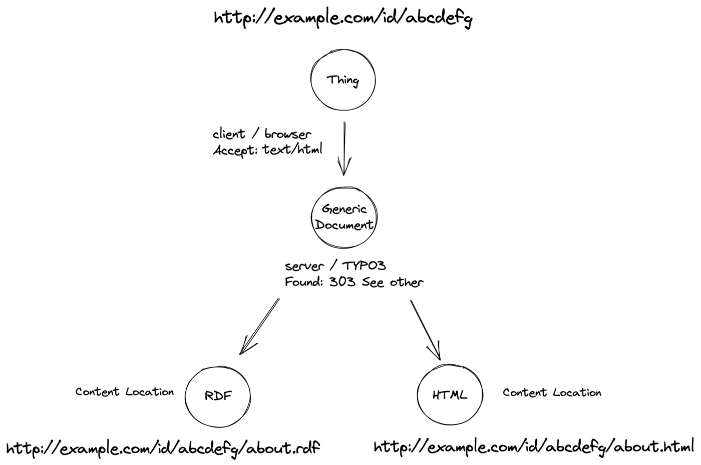

.. ==================================================
.. FOR YOUR INFORMATION
.. --------------------------------------------------
.. -*- coding: utf-8 -*- with BOM.

.. include:: ../Includes.txt

================
Basic Principles
================

The following sections give a brief overview of the most important principles
of Linked Data and their implementation in TYPO3 by the extension.

Short introduction to Linked Data
=================================

In his `linked data note <https://www.w3.org/DesignIssues/LinkedData.html>`_ from 2006 Tim Berners-Lee wrote:

    The Semantic Web isn't just about putting data on the web. It is about making links, so that a person
    or machine can explore the web of data. With linked data, when you have some of it, you can find other,
    related, data.

When we publish our content with TYPO3 as web pages, our primary target group are our human users. Since TYPO3
uses a relational database, our content is already organized in a structured way. Wouldn't it
be nice if we could also publish our content in a standardized and machine readable way so that it is open and
linkable to the `Web of Data <https://www.w3.org/standards/semanticweb/>`_ ?

The LOD extension for TYPO3 aims to do precisely that. It provides a configurable *semantic layer*
over any record in the TYPO3 database that makes it possible to publish your database content as structured
data closely following the four guiding principles defined by Tim Berners-Lee:

1. Use URIs as names for things
2. Use HTTP URIs so that people can look up those names.
3. When someone looks up a URI, provide useful information, using the standards (RDF*, SPARQL)
4. Include links to other URIs. so that they can discover more things.

IRIs, URIs and Resources
========================

The most basic concept in regard to linked data is that of an IRI (or URI). When URIs are
internationalized according to `RFC 3987 <https://datatracker.ietf.org/doc/html/rfc3987>`_,
they are also called **IRIs** (Internationalized Resource Identifiers). The RDF specification
defines IRIs like this:

    Any IRI or literal denotes something in the world (the "universe of discourse"). These things are called
    resources. Anything can be a resource, including physical things, documents, abstract concepts, numbers
    and strings; the term is synonymous with "entity" as it is used in the RDF Semantics specification. The
    resource denoted by an IRI is called its referent, and the resource denoted by a literal is called its
    literal value. Literals have datatypes that define the range of possible values, such as strings, numbers,
    and dates. Special kind of literals, language-tagged strings, denote plain-text strings in a natural language.

In relation to this definition and the first two principles from above, we can regard any record in our
system as a thing - a "resource". The LOD extension provides configurable IRIs as identifiers for any record
in the TYPO3 system (like pages, content elements, news, extension records etc.). The following image
shows a news record with it's IRI:

So when we have HTTP IRIs for our TYPO3 records, we can "look them up" as defined in the second principle.
The LOD extension provides a mechanism that resolves any IRI to a so called `subject page <https://ontola.io/what-is-linked-data/#publishing-linked-data>`_ that provides information *about* the resource using
the **Resource Description Framework** (RDF). This implements the third of the four principles above.

Since IRIs for TYPO3 records can be linked with other IRIs in the TYPO3 backend with a so called
*statement composer* (which realizes the fourth principle), we have all the means to create an
publish our TYPO3 content as structured data.

Namespaces
==========

IRIs can be grouped together in a common `namespace <https://www.w3.org/TR/rdf11-concepts/#vocabularies>`_.
This is often the case for RDF vocabularies and ontologies. Once a namespace is defined, IRIs in this namespace
can be abbreviated with a *prefix*. The LOD extension allows to create namespace records that can then be
assigned to IRIs:

It makes sense to define a namespace for the IRIs that describe your TYPO3 records. Tip: You should use the
http path to the page where your LOD api plugin is placed. This way, IRIs in your namespace can immediately
be resolved via the API.

Representations
===============

https://www.w3.org/TR/cooluris/#r303gendocument

Literals
========

Blank nodes
===========

Statements
==========

(Named) Graphs
==============

Vocabularies and Ontologies
===========================

