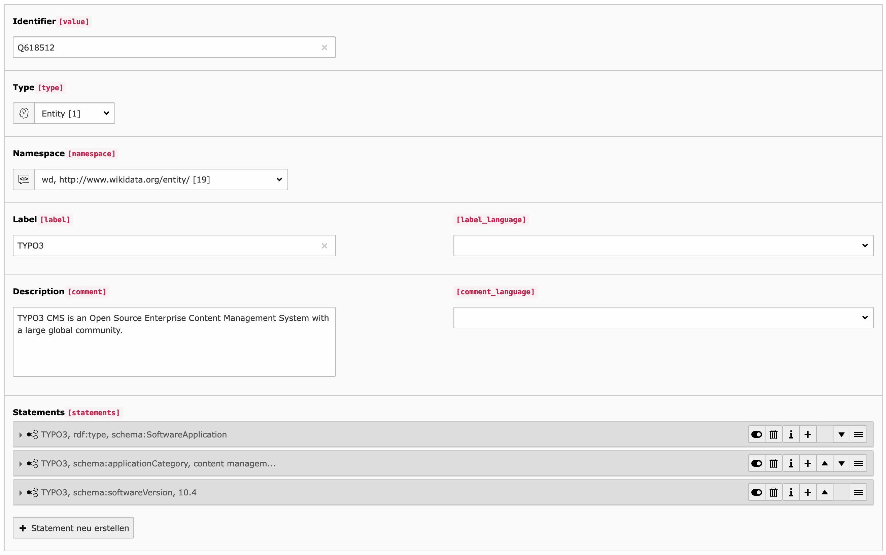
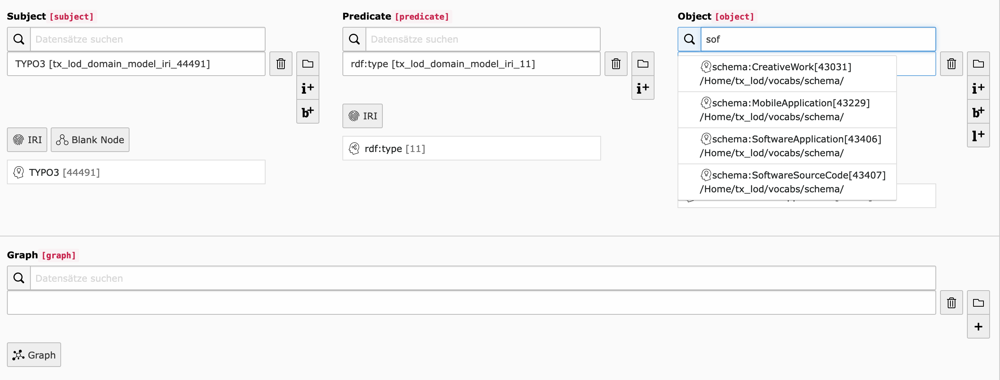
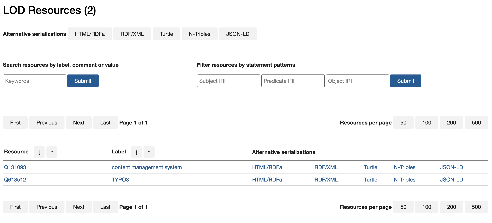

.. ==================================================
.. FOR YOUR INFORMATION
.. --------------------------------------------------
.. -*- coding: utf-8 -*- with BOM.

.. include:: ../Includes.txt

Introduction
------------

What does it do?
^^^^^^^^^^^^^^^^

The TYPO3 LOD extension provides a semantic layer that makes it possible to offer
any record from your database as Linked Open Data. The extension features an out of the box
restful API with content negotiation supporting a broad range of serialization
formats (RDFa, RDF/XML, Turtle, NT, JSON-LD), a configurable permalink resolver for records,
well known RDF vocabularies (like schema.org, SKOS, FOAF etc.) for describing your data
(and also embedded it as JSON-LD in your web pages) and a plugin for creating and publishing
your own LOD vocabularies.

"Any IRI or literal denotes something in the world (the "universe of discourse"). These things are called resources.
Anything can be a resource, including physical things, documents, abstract concepts, numbers and strings; the term is
synonymous with "entity" as it is used in the RDF Semantics specification [RDF11-MT]. The resource denoted by an IRI
is called its referent, and the resource denoted by a literal is called its literal value. Literals have datatypes
that define the range of possible values, such as strings, numbers, and dates. Special kind of literals,
language-tagged strings, denote plain-text strings in a natural language."

Features
^^^^^^^^

- Implementation of the RDF data model in TYPO3 using the backend interface for editing
- (Automatically) create IRIs (Internationalized Resource Identifiers) for any record in the system
- Fully configurable and extendable permalink resolver for stable links to any resource
- Import and use established RDF vocabularies (or create your own) to describe your data semantically
- Statement composer for RDF triples based on IRRE with auto suggest for subjects, predicates and objects
- RESTful API implementing the Hydra standard with content negotiation and a broad range of RDF serializations
- Serializer for embedding structured data in your web pages (as JSON-LD)
- All RDF serializations are based on Fluid templates (no external dependencies)
- Vocabulary plugin for creating and publishing LOD vocabularies

Screenshots
^^^^^^^^^^^

**Screenshot 1: Editing of IRIs with namespace management and easy statement generation**

**Screenshot 2: Statement composer with auto suggest for creating RDF triples**

**Screenshot 3: Restful LOD API with content negotiation, serialization formats and filters**

Credits
^^^^^^^

This extension is developed by the `Digital Academy <http://www.adwmainz.de/digitalitaet/digitale-akademie.html>`_
of the `Academy of Sciences and Literature | Mainz <http://www.adwmainz.de>`_.

Development
^^^^^^^^^^^

Development takes place on `Github <https://github.com/digicademy/lod>`_.
You are very welcome to submit pull requests.
